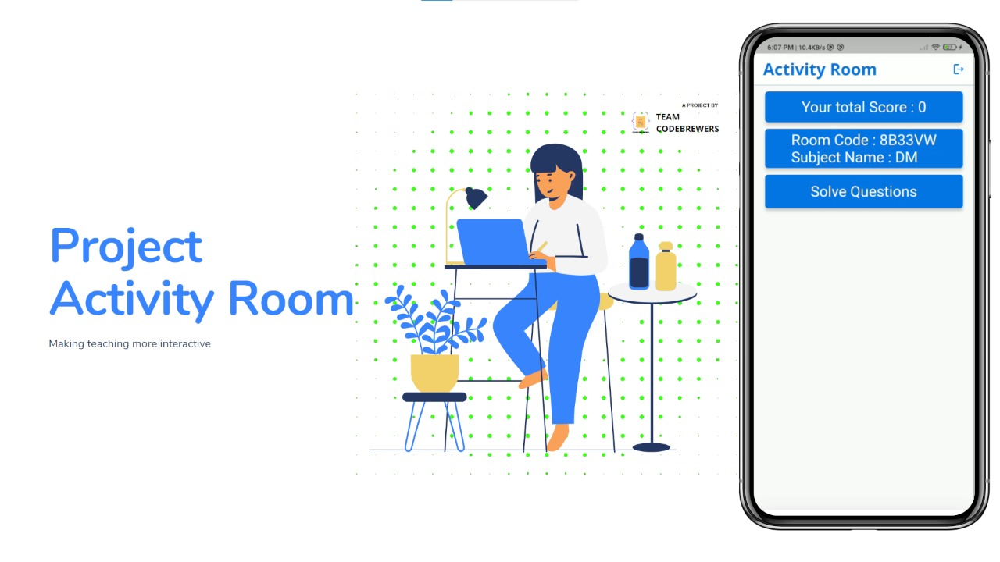
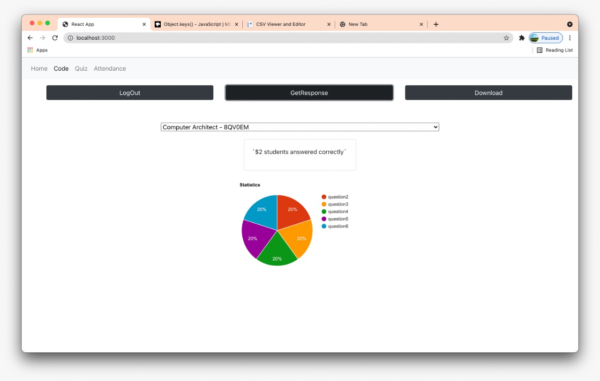

# __ActivityRoom__
     

* The project aims to simplify online     learning experience for teachers and      students.

* We realized that, there are many students who know the answer or understand the lecture, but due to their introvert nature, they do not respond to teacher's question.
And teacher assumes they didn't understood.

* During offline session, teacher can understand student from their  expression, but in online session it is a barrier.
There are alternatives, like form based quiz, but manging form links, distribuitng, is hassle, sometimes it also doesn't accept response and other problems.

* So our project, simplifies this experience by providing a UI to easily generate isolated classroom, generate Live Quiz, check who have joned the ongoing session. As well as get statistics regarding performance of students for the quiz.
Also the responses can be downloaded for the current session in a CSV file. Statistics is also displayed in form of pie chart.

* This project also tackles the issue of fake attendance, by providing a QR code which gets updated every 10 sec, so by the time code is circulated, it is changed.

## <b>Future Scope: </b>

* Currently, MCQ questions are supported, but we can add functionality for descriptive type questions.

* To enchance the experience, we think of adding a chat functionality with the teacher, announcements creation by teacher, which notifies student on our Android App. 
* Recordings playback*:
Since, lectures are recorded, teachers can upload it to our system and students can access it. 
* We also think of adding live streaming services.

Currently, this type of idea is present but it involves accessing differnet resources for different things. This will enable to have all related resources at one platform. With this we aim to bring all functionalities as required by teacher and student during online lectures at one place.

